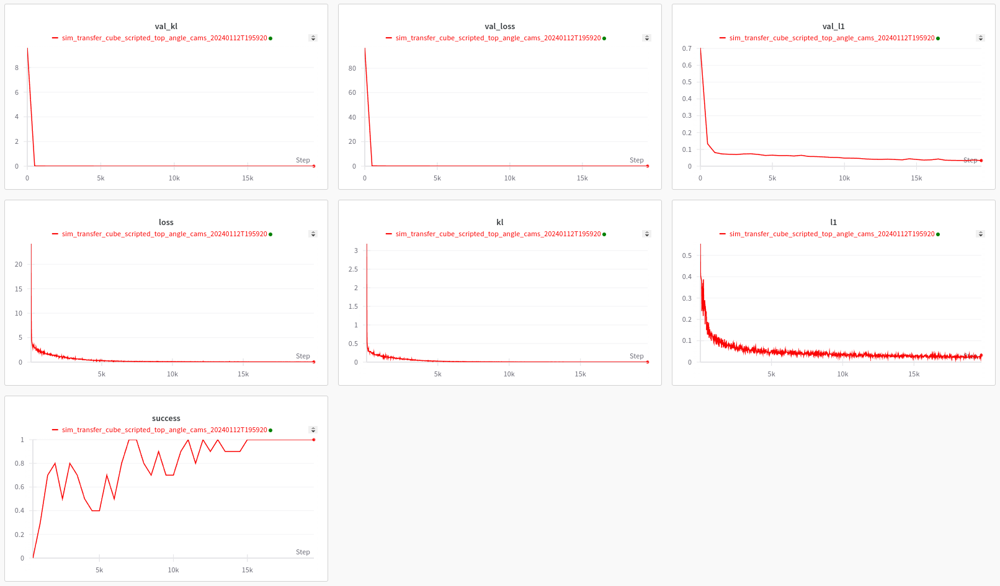
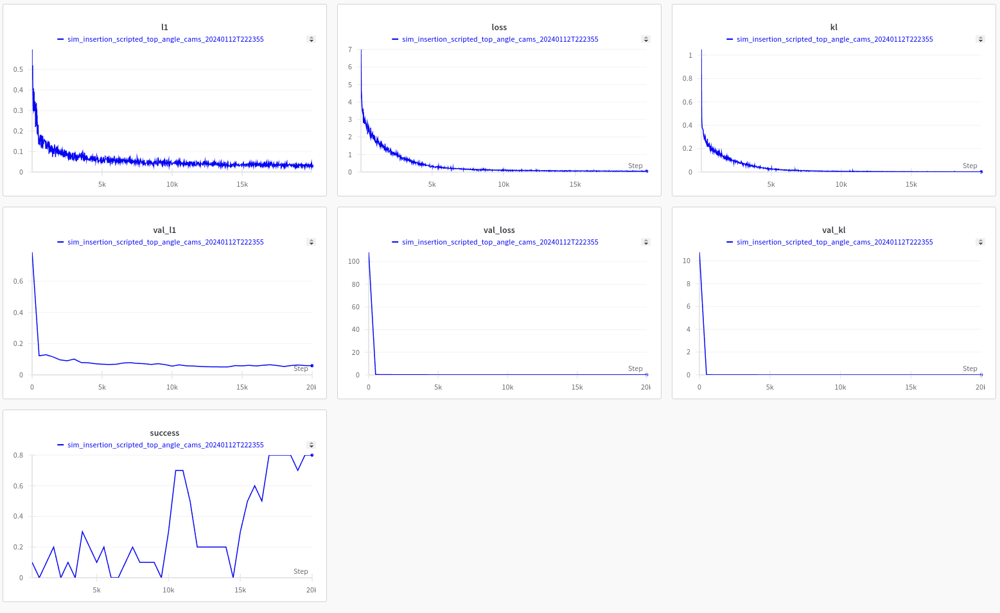
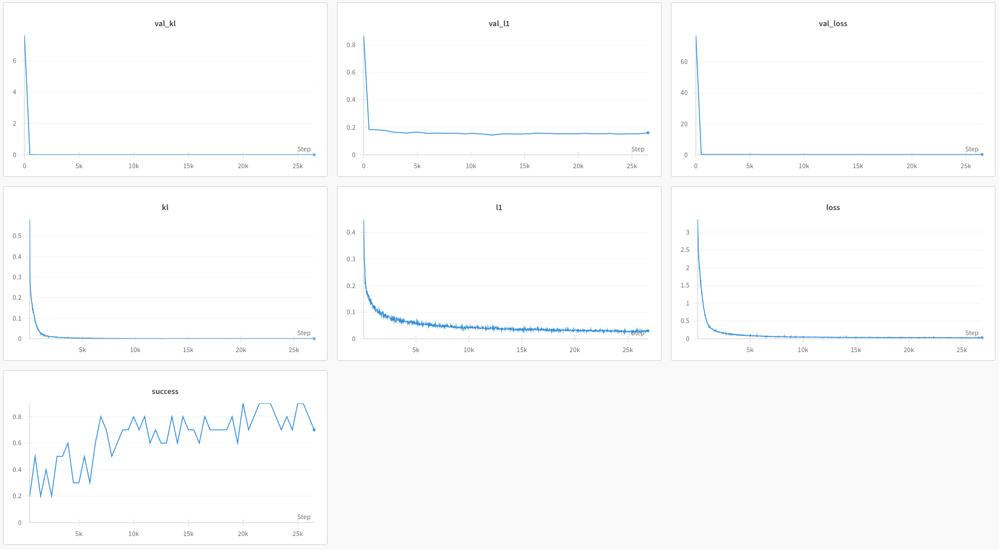
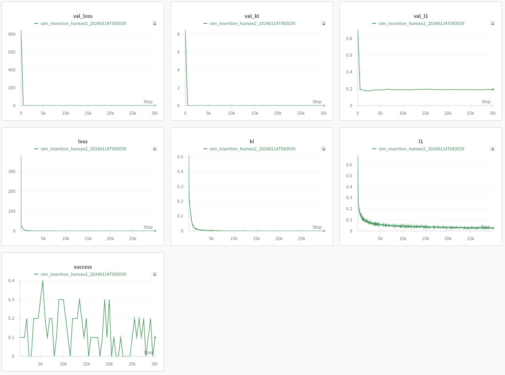

# Imitation Learning algorithms and Co-training for Mobile ALOHA


#### Project Website: https://mobile-aloha.github.io/

This repo contains the implementation of ACT, Diffusion Policy and VINN, together with 2 simulated environments:
Transfer Cube and Bimanual Insertion. You can train and evaluate them in sim or real.
For real, you would also need to install [Mobile ALOHA](https://github.com/MarkFzp/mobile-aloha). This repo is forked from the [ACT repo](https://github.com/tonyzhaozh/act).

### Updates:
You can find all scripted/human demo for simulated environments [here](https://drive.google.com/drive/folders/1gPR03v05S1xiInoVJn7G7VJ9pDCnxq9O?usp=share_link).

```shell
git clone --recursive git@github.com:inkyusa/act_private.git
```

### Repo Structure
- ``imitate_episodes.py`` Train and Evaluate ACT
- ``policy.py`` An adaptor for ACT policy
- ``detr`` Model definitions of ACT, modified from DETR
- ``sim_env.py`` Mujoco + DM_Control environments with joint space control
- ``ee_sim_env.py`` Mujoco + DM_Control environments with EE space control
- ``scripted_policy.py`` Scripted policies for sim environments
- ``constants.py`` Constants shared across files
- ``utils.py`` Utils such as data loading and helper functions
- ``visualize_episodes.py`` Save videos from a .hdf5 dataset

### Software version

It is important to exactly match the below software package version in order to correctly make sure simulation dataset generation.

| Software   | Version |
|------------|---------|
| python     | 3.8.10  |
| CUDA       | 11.8    |
| torch      | 2.0.1+cu118  |
| cuDNN      | 8902    |
| mujoco     | 2.3.7   |
| dm_env     | 1.6     |
| dm_control | 1.0.14  |


### Installation
```shell
    conda create -n aloha python=3.8.10
    conda activate aloha
    pip install torch==2.0.1+cu118 torchvision==0.15.2+cu118 torchaudio==2.0.2+cu118 --extra-index-url https://download.pytorch.org/whl/cu118
    
    pip install pyquaternion pyyaml rospkg pexpect mujoco dm_control opencv-python matplotlib einops packaging h5py ipython wandb diffusers
    
    cd act_private/detr
    pip install -e .
    cd act_private/robomimic
    pip install -e .
```

### Example Usages

To set up a new terminal, run:
```shell
    conda activate aloha
    cd <path to act repo>
```
### Simulated experiments

We use ``sim_transfer_cube_scripted`` task in the examples below. Another option is ``sim_insertion_scripted``. After running these scripts, you should be able to check `Success: 50 / 50`. Otherwise, check the installed python packages (e.g., `Mujoco`, `dm_env`, and `dm_control`)

#### transfer_cube_scripted dataset generation
To generated 50 episodes of transfer_cube_scripted data, run:
```shell
    python3 record_sim_episodes.py --task_name sim_transfer_cube_scripted --dataset_dir data/sim/sim_transfer_cube_scripted_top_angle_cams --num_episodes 50
```
This will create `data/sim/sim_transfer_cube_scripted_top_angle_cams` folder under the root repository.

#### insertion_scripted dataset generation
```
python3 record_sim_episodes.py --task_name sim_insertion_scripted --dataset_dir data/sim/sim_insertion_scripted_top_angle_cams --num_episodes 50
```

Adding the flag ``--onscreen_render`` to see real-time rendering.
To visualize `i` episode after it is collected, run
```shell
    python3 visualize_sim_episodes.py --dataset_dir data/sim/sim_transfer_cube_scripted_top_angle_cams/ --episode_idx 0
```
or this will visualise all episodes
```shell
for i in {0..50}; do python3 visualize_sim_episodes.py --dataset_dir data/sim/sim/sim_transfer_cube_scripted_top_angle_cams --episode_idx $i; done
```
### Train ACT:

#### Train sim_transfer_cube_scripted
```shell
    # Transfer Cube task
    python3 imitate_episodes.py --task_name sim_transfer_cube_scripted --ckpt_dir ckpt/sim_transfer_cube_scripted_top_angle_cams --policy_class ACT --kl_weight 10 --chunk_size 100 --hidden_dim 512 --batch_size 16 --dim_feedforward 3200 --num_steps 20000  --lr 1e-5 --seed 0 --save_every 1000
```
The model should perform above 90% success after 15k steps as shown below 


Below demonstrates the evaluation of the best performed policy that we trained from above in various views.


#### Train sim_insertion_scripted
```shell
    # Insertion task
    python3 imitate_episodes.py --task_name sim_insertion_scripted --ckpt_dir ckpt/sim_insertion_scripted_top_angle_cams --policy_class ACT --kl_weight 10 --chunk_size 100 --hidden_dim 512 --batch_size 16 --dim_feedforward 3200 --num_steps 20000  --lr 1e-5 --seed 0 --save_every 1000
```

For this task, the model achieved 80% success after 17k iterations.


Below demonstrates the evaluation of the best performed policy that we trained from above.


#### Train sim_transfer_cube_human
```shell
    # Transfer Cube task
    python3 imitate_episodes.py --task_name sim_transfer_cube_human --ckpt_dir ckpt/sim_transfer_cube_human --policy_class ACT --kl_weight 10 --chunk_size 50 --hidden_dim 512 --batch_size 16 --dim_feedforward 3200 --num_steps 26500 --lr 1e-5 --seed 0 --save_every 1000
```

For this task, the model achieved 90% success after 26k iterations.


Below demonstrates the evaluation of the best performed policy that we trained from above.

(Success)


(Fail)


#### Train sim_insertion_human
```shell
    # Transfer Cube task
    python3 imitate_episodes.py --task_name sim_insertion_human --ckpt_dir ckpt/sim_insertion_human --policy_class ACT --kl_weight 10 --chunk_size 100 --hidden_dim 512 --batch_size 16 --dim_feedforward 3200 --num_steps 26500 --lr 1e-5 --seed 0 --save_every 1000
```

For this task, the model achieved 40% best success after 30k iterations.


Below demonstrates the evaluation of the best performed policy that we trained from above.

(Success)


(Fail)


The model trained with this dataset performs the worst among above 4 tasks. There may exist some room to improve the performance.

### Dataset download (WIP, sharing via Kaggle since dataset is too large~247.7GB)
Note that you downloaded simulated environments [here](https://drive.google.com/drive/folders/1gPR03v05S1xiInoVJn7G7VJ9pDCnxq9O?usp=share_link) and used that dataset for training (only has top view camera so that need to change this in `constants.py` file).

### Evaluation ACT:
To evaluate the policy, run the same command but add ``--eval``. This loads the best validation checkpoint.
The success rate should be around 90% for transfer cube, and around 50% for insertion.
To enable temporal ensembling, add flag ``--temporal_agg``.
Videos will be saved to ``<ckpt_dir>`` for each rollout.
You can also add ``--onscreen_render`` to see real-time rendering during evaluation.

### Pre-trained weights:
One can download and test policies that we trained above for the cube transfer and insertion tasks.

* [Sim cube transfer task (scripted) ckpt](https://drive.google.com/drive/folders/1cfOzGvxdWl3BOwOy2b8whQcEAeoy5PeO?usp=drive_link)
* [Sim insertion task (scripted) ckpt](https://drive.google.com/drive/folders/107xSeIJjt8nY0i3IllNfNk9Fgz9-Bqe0?usp=sharing)
* [Sim cube transfer task (human) ckpt](https://drive.google.com/drive/folders/1yCuGh0Wn0lgeBrr32xWN4gTA16Vg-TES?usp=drive_link)
* [Sim insertion task (human) ckpt](https://drive.google.com/drive/folders/1yCuGh0Wn0lgeBrr32xWN4gTA16Vg-TES?usp=drive_link)

After downloading these ckpts, if you want to evaluate them, just place them under `ckpt` folder and specify the path for `--ckpt_dir` argument. Below shows an example command to do this.
```shell
python3 imitate_episodes.py --task_name sim_transfer_cube_scripted --ckpt_dir ckpt/sim_transfer_cube_scripted_top_angle_cams --policy_class ACT --kl_weight 10 --chunk_size 100 --hidden_dim 512 --batch_size 16 --dim_feedforward 3200 --num_steps 20000  --lr 1e-5 --seed 0 --save_every 1000 --eval
```


For real-world data where things can be harder to model, train for at least 5000 epochs or 3-4 times the length after the loss has plateaued.
Please refer to [tuning tips](https://docs.google.com/document/d/13RcPc7SSSkK6wVeIK6J-pj709nPj9Lh_y6eUSNJziEQ/edit?usp=sharing) for more info.

### [ACT tuning tips](https://docs.google.com/document/d/13RcPc7SSSkK6wVeIK6J-pj709nPj9Lh_y6eUSNJziEQ/edit?usp=sharing)
TL;DR: if your ACT policy is jerky or pauses in the middle of an episode, just train for longer! Success rate and smoothness can improve way after loss plateaus.

Note: Mobile-aloha github https://github.com/MarkFzp/mobile-aloha


### Trouble shooting:
* `Error loading /home/user/workspace/act_private/data/sim/sim_insertion_scripted/episode_32.hdf5 in __getitem__` -> check `SIM_TASK_CONFIGS` in `constants.py` file. `dataset_dir`, `camera_names` set properly as of the recorded dataset?
* Poor successful rate. check the installed python packages (e.g., `Mujoco`, `dm_env`, and `dm_control`). see here https://github.com/MarkFzp/act-plus-plus/issues/12
* It appears to be challenging to learn from images taken by cameras on the left and right wrists. For instance, model training was unsuccessful (with a low success rate of about 10%) using 3 cameras [top, left wrist, right wrist], whereas it achieved a 100% success rate with two cameras [top, angle]. The positions and orientations of the cameras on the left and right wrists change with every iteration, whereas the 'top' and 'angle' cameras are ego-centric and static.
